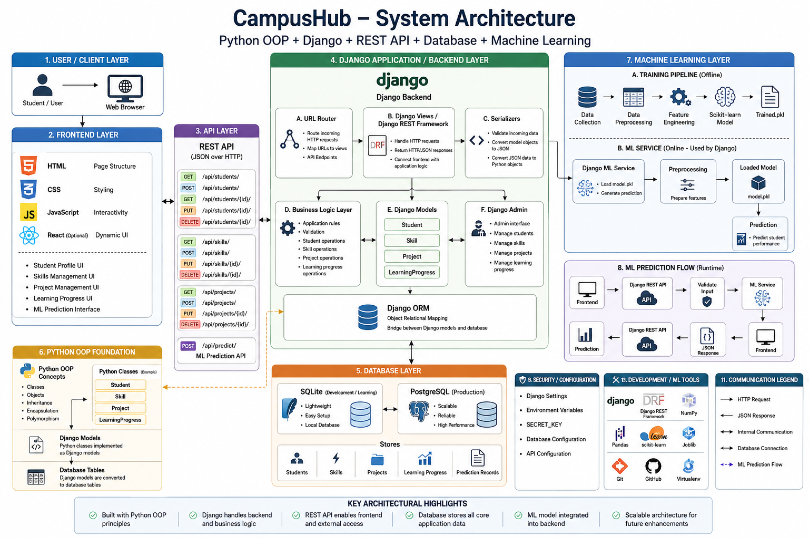
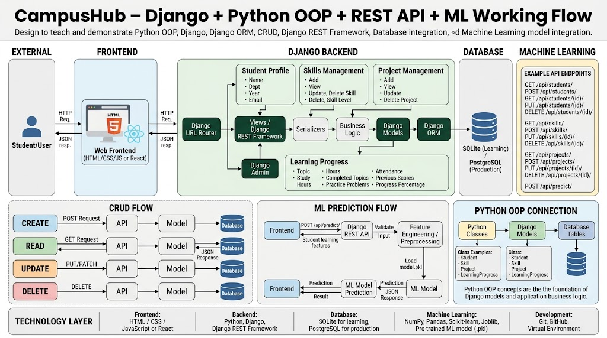

# 🎓 CampusHub-Django-ML

<p align="center">

  

  

  

  

  

  

</p>

<p align="center">

<strong>A learning-focused Student Management System built to combine Python OOP, Django, REST APIs, and Machine Learning.</strong>

</p>

<p align="center">
  <a href="https://github.com/hemnath-kandasamyk/CampusHub-Django-ML">
    
  </a>

  <a href="https://github.com/hemnath-kandasamyk/CampusHub-Django-ML/forks">
    
  </a>

</p>

---

## 📌 About The Project

**CampusHub-Django-ML** is a learning-focused student management system designed to explore how different software engineering concepts can work together inside a real-world application.

The project is being developed incrementally, starting from **Python Object-Oriented Programming** and progressing toward:

```text
Python OOP
     ↓
Django
     ↓
Database & ORM
     ↓
CRUD Operations
     ↓
REST API
     ↓
Machine Learning
     ↓
Intelligent Student Management System
```

The main goal is not just to build another CRUD application, but to understand how a production-style application can evolve from fundamental Python concepts into a complete **Django + REST API + Machine Learning** system.

---

## 🎯 Project Objectives

The project focuses on learning and implementing:

* 🐍 Python Object-Oriented Programming
* 🏗️ Django project architecture
* 🗄️ Database design and Django ORM
* 🔄 CRUD operations
* 🔐 Authentication and authorization
* 🔌 REST API development
* 🤖 Machine Learning integration
* 📊 Data processing and prediction
* 🧪 Testing and debugging
* 📚 Clean project structure
* 🔧 Git and GitHub workflow
* 🚀 Deployment-ready application architecture

---

# ✨ Core Features

> 🚧 Features are being implemented incrementally as part of the learning roadmap.

### 👨‍🎓 Student Management

* Student registration
* Student profile management
* Student information management
* Student record retrieval
* Student update and deletion

### 📚 Academic Management

Planned academic modules include:

* Course management
* Department management
* Subject management
* Academic performance
* Attendance tracking
* Result management

### 🔐 Authentication

Planned authentication features:

* User registration
* Login / Logout
* Role-based access
* Admin access
* Student access
* Secure password handling

### 🔌 REST API

The project is designed to expose application functionality through REST APIs.

Planned API capabilities include:

```text
GET     /api/students/
POST    /api/students/
GET     /api/students/<id>/
PUT     /api/students/<id>/
DELETE  /api/students/<id>/
```

### 🤖 Machine Learning

The ML layer will allow the system to move beyond simple data management.

Potential ML capabilities include:

* Student performance prediction
* Academic risk identification
* Performance classification
* Student recommendation
* Data-driven insights

---

# 🧠 Python OOP Learning Layer

One of the main purposes of this project is to understand how **Python OOP concepts translate into a real Django application**.

Concepts explored include:

| OOP Concept    | Application                          |
| -------------- | ------------------------------------ |
| Classes        | Student / domain models              |
| Objects        | Student instances                    |
| Encapsulation  | Controlled data access               |
| Inheritance    | Reusable model behavior              |
| Polymorphism   | Flexible application behavior        |
| Abstraction    | Separation of implementation details |
| Methods        | Business logic                       |
| Constructors   | Object initialization                |
| Class Methods  | Class-level operations               |
| Static Methods | Utility functionality                |

### Example

```python
class Student:

    def __init__(self, name, department, cgpa):
        self.name = name
        self.department = department
        self.cgpa = cgpa

    def display_info(self):
        return f"{self.name} - {self.department} - {self.cgpa}"
```

The idea is to gradually move from simple Python classes toward Django's model-driven architecture.

---

# 🏗️ System Architecture

The project architecture is maintained inside:

```text
docs/
└── architecture/
    ├── architecture.png
    └── working_flow.png
```

## Architecture Diagram

<p align="center">
  
</p>

---

# 🔄 Working Flow

<p align="center">
  
</p>

### High-Level Flow

```text
                 ┌───────────────────┐
                 │       User        │
                 └─────────┬─────────┘
                           │
                           ▼
                 ┌───────────────────┐
                 │   Django Views    │
                 └─────────┬─────────┘
                           │
                           ▼
                 ┌───────────────────┐
                 │   Business Logic  │
                 └─────────┬─────────┘
                           │
              ┌────────────┴────────────┐
              ▼                         ▼
      ┌───────────────┐         ┌───────────────┐
      │ Django ORM    │         │ REST API      │
      └───────┬───────┘         └───────┬───────┘
              │                         │
              ▼                         │
      ┌───────────────┐                 │
      │   Database    │                 │
      └───────────────┘                 │
                                        ▼
                              ┌──────────────────┐
                              │ Machine Learning │
                              └────────┬─────────┘
                                       │
                                       ▼
                              ┌──────────────────┐
                              │ Prediction /     │
                              │ Insights         │
                              └──────────────────┘
```

---

# 🛠️ Technology Stack

## Backend

* 🐍 Python
* 🌐 Django
* 🔌 Django REST Framework
* 🗄️ Django ORM

## Database

* SQLite — development
* PostgreSQL — production-ready option

## Machine Learning

* NumPy
* Pandas
* Scikit-learn
* Matplotlib
* Jupyter Notebook

## Development Tools

* Git
* GitHub
* VS Code
* Python Virtual Environment

---

# 📂 Project Structure

The project is being structured to keep application logic, configuration, documentation, and ML components separated.

```text
CampusHub-Django-ML/
│
├── docs/
│   └── architecture/
│       ├── architecture.png
│       └── working_flow.png
│
├── backend/
│   ├── config/
│   ├── students/
│   └── ...
│
├── ml/
│   ├── datasets/
│   ├── notebooks/
│   ├── models/
│   └── ...
│
├── .gitignore
├── manage.py
├── requirements.txt
└── README.md
```

> The structure will evolve as new Django applications and ML components are added.

---

# ⚙️ Getting Started

## 1️⃣ Clone the Repository

```bash
git clone https://github.com/hemnath-kandasamyk/CampusHub-Django-ML.git
```

## 2️⃣ Move Into The Project

```bash
cd CampusHub-Django-ML
```

## 3️⃣ Create Virtual Environment

### Windows

```bash
python -m venv venv
```

Activate:

```bash
venv\Scripts\activate
```

### Linux / macOS

```bash
python3 -m venv venv
```

```bash
source venv/bin/activate
```

---

# 📦 Install Dependencies

```bash
pip install -r requirements.txt
```

If `requirements.txt` is not available yet:

```bash
pip install django
```

---

# 🗄️ Database Setup

Run Django migrations:

```bash
python manage.py makemigrations
```

```bash
python manage.py migrate
```

Create an administrator account:

```bash
python manage.py createsuperuser
```

---

# ▶️ Run The Application

Start the development server:

```bash
python manage.py runserver
```

Open:

```text
http://127.0.0.1:8000/
```

Django Admin:

```text
http://127.0.0.1:8000/admin/
```

---

# 🔌 REST API

The REST API layer will provide programmatic access to CampusHub resources.

Example architecture:

```text
Client
  │
  ▼
REST API
  │
  ▼
Serializer
  │
  ▼
Django View / ViewSet
  │
  ▼
Django ORM
  │
  ▼
Database
```

Example endpoint structure:

```text
/api/students/
/api/students/<id>/
/api/courses/
/api/attendance/
/api/results/
```

> API endpoints will be documented as the implementation progresses.

---

# 🤖 Machine Learning Pipeline

The Machine Learning layer is designed to follow a standard ML workflow.

```text
Raw Data
   ↓
Data Collection
   ↓
Data Cleaning
   ↓
Exploratory Data Analysis
   ↓
Feature Engineering
   ↓
Train / Test Split
   ↓
Model Training
   ↓
Model Evaluation
   ↓
Model Serialization
   ↓
Django Integration
   ↓
Prediction
```

## Possible ML Workflow

```python
student_data
      ↓
preprocessing
      ↓
feature_selection
      ↓
trained_model
      ↓
prediction
      ↓
Django response
```

This allows the project to demonstrate how a trained ML model can eventually become part of a web application.

---

# 📊 Machine Learning Integration

The long-term goal is to connect the ML model with Django.

```text
             Student Input
                   │
                   ▼
          ┌─────────────────┐
          │ Django Backend  │
          └────────┬────────┘
                   │
                   ▼
          ┌─────────────────┐
          │ Data Processing │
          └────────┬────────┘
                   │
                   ▼
          ┌─────────────────┐
          │ Trained ML Model│
          └────────┬────────┘
                   │
                   ▼
              Prediction
                   │
                   ▼
             API Response
```

For example:

```python
prediction = model.predict(student_features)
```

The prediction can then be returned through a Django view or REST API endpoint.

---

# 🧪 Testing

Testing will be added as the project grows.

Django tests can be executed using:

```bash
python manage.py test
```

Future testing areas:

* Model tests
* API tests
* Authentication tests
* CRUD tests
* ML prediction tests
* Integration tests

---

# 🔐 Security Considerations

The project will follow Django's built-in security mechanisms wherever possible.

Planned security practices include:

* Password hashing
* Authentication
* Authorization
* CSRF protection
* Input validation
* Environment variables for secrets
* Secure database configuration
* API permission handling
* Production security settings

### ⚠️ Never commit secrets

Do not commit:

```text
.env
API keys
Passwords
Secret keys
Database credentials
Private certificates
```

Use environment variables instead.

---

# 📈 Development Roadmap

## Phase 1 — Python OOP

* [x] Python fundamentals
* [x] Classes and objects
* [x] Encapsulation
* [x] Inheritance
* [x] Polymorphism
* [x] Abstraction
* [ ] OOP-based domain models

## Phase 2 — Django

* [ ] Django project setup
* [ ] Django apps
* [ ] Models
* [ ] Views
* [ ] Templates
* [ ] Forms
* [ ] Django ORM
* [ ] Admin customization
* [ ] CRUD operations

## Phase 3 — REST API

* [ ] Django REST Framework
* [ ] Serializers
* [ ] API Views
* [ ] ViewSets
* [ ] Routers
* [ ] API authentication
* [ ] API documentation

## Phase 4 — Machine Learning

* [ ] Dataset preparation
* [ ] EDA
* [ ] Feature engineering
* [ ] Model training
* [ ] Model evaluation
* [ ] Model serialization
* [ ] Prediction API

## Phase 5 — Integration

* [ ] Connect ML model with Django
* [ ] Create prediction endpoints
* [ ] Connect frontend
* [ ] Add dashboards
* [ ] Add analytics
* [ ] Improve security

## Phase 6 — Deployment

* [ ] Production settings
* [ ] PostgreSQL
* [ ] Environment variables
* [ ] Docker
* [ ] CI/CD
* [ ] Cloud deployment

---

# 📚 What I'm Learning Through This Project

This project is also my practical learning laboratory.

### Python

```text
OOP
│
├── Classes
├── Objects
├── Inheritance
├── Polymorphism
├── Encapsulation
└── Abstraction
```

### Django

```text
Django
│
├── Models
├── Views
├── Templates
├── URLs
├── Forms
├── ORM
└── Admin
```

### Backend

```text
Backend
│
├── CRUD
├── Authentication
├── REST APIs
├── Validation
└── Database
```

### Machine Learning

```text
ML
│
├── Data Processing
├── EDA
├── Feature Engineering
├── Model Training
├── Evaluation
└── Prediction
```

---

# 🧩 Why CampusHub?

Many student management projects focus only on CRUD operations.

CampusHub is designed to go one step further:

```text
          Traditional Student System

             Student Records
                    │
                    ▼
              CRUD Operations
                    │
                    ▼
                 Database


                 CampusHub

             Student Records
                    │
                    ▼
              Django Backend
                    │
             ┌──────┴──────┐
             ▼             ▼
        REST API       Database
             │
             ▼
       Machine Learning
             │
             ▼
        Smart Insights
```

The long-term vision is to transform a simple student management application into an **intelligent academic platform**.

---

# 📖 Learning Resources

Some useful technologies and concepts explored in this project:

* Python
* Django
* Django REST Framework
* SQL
* Object-Oriented Programming
* Machine Learning
* Git & GitHub
* REST API Design
* Software Architecture

---

# 🚀 Future Enhancements

Possible future improvements include:

* 📊 Student analytics dashboard
* 🤖 AI-powered academic predictions
* 📈 Performance visualization
* 🎯 Personalized learning recommendations
* 📅 Attendance analytics
* 🔔 Notification system
* 🔐 Advanced role-based access control
* 📱 Mobile application
* ☁️ Cloud deployment
* 🐳 Docker support
* 🔄 CI/CD pipeline
* 📚 API documentation with Swagger / OpenAPI

---

# 🤝 Contributing

This is currently a personal learning project, but suggestions and improvements are welcome.

If you would like to contribute:

```bash
git fork
```

Create a feature branch:

```bash
git checkout -b feature/your-feature
```

Commit your changes:

```bash
git commit -m "Add: your feature"
```

Push:

```bash
git push origin feature/your-feature
```

Then open a Pull Request.

---

# 👨‍💻 Author

## Hemnath KK

**AI & Data Science Student | Developer | Problem Solver**

Interested in:

```text
Java
Python
SQL
Machine Learning
Django
REST APIs
System Design
DSA
UI/UX
```

### Connect With Me

<p align="center">

<a href="https://github.com/hemnath-kandasamyk">
  
</a>

<a href="https://www.linkedin.com/in/hemnath-kandasamy-k-42a269353/">
  
</a>

</p>

---

# ⭐ Support

If you find this project useful or interesting:

⭐ Star the repository

🍴 Fork the repository

🐛 Report issues

💡 Suggest improvements

---

# 📜 License

This project is intended for educational and learning purposes.

A formal open-source license can be added as the project matures.

---

<p align="center">

### 🚀 Building. Learning. Improving.

**CampusHub-Django-ML**

*From Python OOP → Django → REST API → Machine Learning*

</p>
